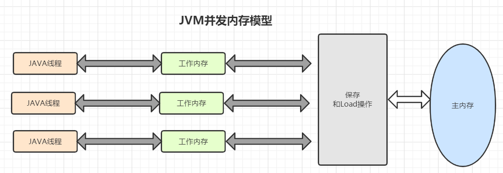

# JVM的内存模型

java内存在逻辑上分为工作内存（线程独有）和主内存（共享）

其中工作内存是抽象出来的，实际中并没有这样一块物理内存。工作内存涵盖了诸多存储区域（缓存，写缓冲区，寄存器等），在工作内存中包含了 线程`读/写共享变量的副本`，即这个变量存在主内存中，但是在工作内存中会为每个线程拷贝一个变量的副本。

JVM将内存划分为 `线程栈区`和`堆区`

## 线程栈区

线程栈区包括

1. PC 程序计数器
2. Visual Machine Stack(虚拟机栈)
3. Native Method Stack (本地方法栈)  
   这些都是线程独有的。PC是保存下一条将要执行的指令的地址。

### Visual Machine Stack 虚拟机栈

这个也可以认为是java栈，该区域由一个个栈帧（frame）组成，每个方法调用都会生成一个frame。 每个frame都包含三部分：

1. Local Variables Table 本地变量表
2. Operation Stack 操作栈
3. Dynamic Linking 动态连接

### 本地方法栈
保存了native方法

## 堆区

