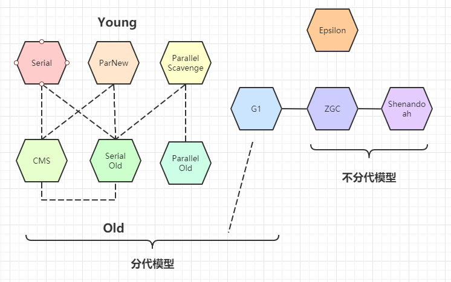

# GC
在讲GC之前，先明确一下JVM的内存模型，GC发生的地点是堆区

## 垃圾标记算法
用来标记哪些对象是垃圾对象的算法
### Reference Count
引用计数，每一个外部对象指向对象A,则对象A的引用计数就+1，当A的引用计数为0时，A就可以认为是垃圾对象。但是这里存在一个问题：
java的引用计数算法无法解决循环引用问题，即A->B->C->A，A、B、C三个对象循环引用，没有其他外部对象指向它们，这三个对象都是垃圾，
但是引用计数却不为0

### Root Search 
根可达算法，指定根对象，然后从根对象出发进行遍历标记，经过一次遍历，没有被标记过的对象即为垃圾对象。
- 根对象：包括但不限于 
    1. 线程栈变量：可以认为是启动但未停止的java线程
    2. 静态变量
    3. 常量池中的引用
    4. JNI指针，native方法所设计的引用对象
    
## 垃圾回收算法
垃圾回收算法有三种，这三种垃圾回收算法各有优劣，适合不同的场景。
在同一个JVM中并非只使用一种垃圾回收算法，通常都是根据不同区域的特点进而使用不同的垃圾回收算法。
1. Mark-Sweep 标记-清除算法：原理比较简单，第一遍遍历堆中的对象，将垃圾对象`标记`出来，第二遍将标记的垃圾对象进行清除。
   - 优点： 实现简单
   - 缺点： 需要两遍遍历，效率较低；会产生内存碎片
    
2. Copying 拷贝算法： 将堆内存分为两部分，每次只使用其中一半内存来分配对象空间，当使用的这一半内存快满了，就将目前存活对象`Copy`
到另一部分内存，这样原来的内存中就剩下垃圾和已拷贝的内存，这样的话可以将这块内存全部清除。而且在拷贝时会进行会进行内存整理。
   - 优点： 只需要遍历一边，效率较高；而且拷贝时会整理内存，不会产生内存碎片
   - 缺点： 需要将内存一分为二，浪费内存空间
    
3. Mark-Compact 标记-压缩算法： 这个算法先遍历一边堆内存，将内存中的存活对象和垃圾对象标记。第二遍时将存活对象拷贝到相近的内存区域，
   剩下的内存区域就可以进行回收了。
   - 优点： 不需要将内存一分为二，节省内存空间；不会产生内存碎片
   - 缺点： 遍历两次，效率较低

## 垃圾回收器（组合）

垃圾回收器按照模型可以划为分代模型和不分代模型两种；分代模型包括：

## 分代模型

## CMS

## G1

## ZGC

## 并发标记算法
1. 三色标记算法
2. 染色指针