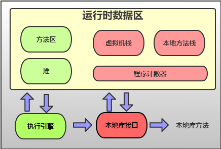
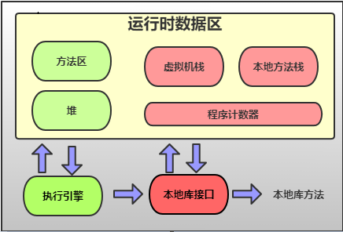
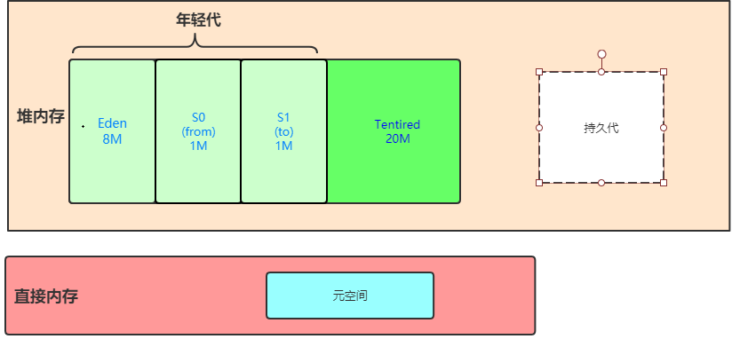
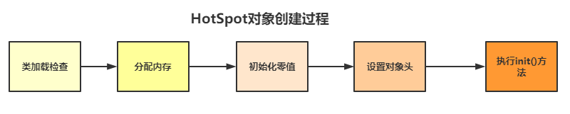

# Java内存区域

## 运行时数据区
<!--    -->
<!--    -->

JVM在运行java进程时会将管理的内存分为若干个区域，我们根据线程之间的是否共享来对内存进行划分    
在jdk1.6时：  
-  线程共享的区域：堆，方法区（包括常量池），直接内存（这部分不属于运行时数据区）   
-  线程独占的区域：虚拟机栈，本地方法栈，程序计数器

在jdk1.8时：在运行时数据区移出了方法区，在直接内存里面添加了元空间  
-  线程共享：堆，直接内存（包括元空间）  
-  线程独占：虚拟机栈，本地方法栈，程序计数器  

下面介绍各个区域：
1. 程序计数器：如同OS中的程序计数器一样，记录下一条指令的内存地址。由于每个线程在不同的CPU上并发执行，所以每个线程都会独占一个程序计数器，来记录线程执行中的下一条字节指令的地址。OS中PC是有一个专属寄存器来存放下一条机器指令的内存地址，在java中在内存中单独为每个线程分配一块空间来存放下一条指令的地址。程序计数器两个作用：  
    1. 字节码解释器通过改变程序计数器来依次读取指令，从而实现代码的流程控制，如：顺序执行、选择、循环、异常处理
    2. 在多线程的情况下，程序计数器用于记录当前线程执行的位置，从而当线程被切换回来的时候恢复到指令跳转时的位置  
2. 虚拟机栈：虚拟机栈也是线程私有的，其生命周期与线程相同，当线程被销毁时，该内存会被回收。java内存可以粗糙的分为堆空间和栈空间，其中栈空间就是虚拟机栈，或者说栈空间是虚拟机栈的局部变量表部分。虚拟机栈是由一个个栈帧组成的，每个栈帧都拥有：局部变量表、操作数栈、动态链接、方法出口信息。局部变量表主要存放了编译器可知的各种数据类型（八种基本类型）以及对象引用（reference类型，根据对象寻址方式不同，对象引用可以是对象内存地址，也可以是指向对象地址的句柄）  
虚拟机栈可能出现的两种异常：
    1. StackOverFlowError
    2. OutOfMemoryError
3. 本地方法栈:由于jvm底层是由c,c++以及汇编写的，所以底层会调用一些native方法（即C）

4. 堆：heap又被称为GC堆，因为堆是垃圾回收的主要内存区域。堆分为年轻代和年老代  
  
当我们new一个对象的时候，jvm会根据对象大小为对象分配内存空间。若对象过大，则会被分配到老年代，一般对象首次创建放在年轻代的Eden区，当对象达到一定年龄（默认CMS6次，其他15次GC）将对象放到年老代。  

5. 方法区：与堆一样是线程共享的区域，用于存储已被虚拟机加载的类信息、常量、静态变量、即时编译器编译后的代码等数据。方法区包括运行时常量池，比如说字符串常量池，这些我会开篇新博客讲述

## HotSpot虚拟机对象
下面介绍有关Hotspot虚拟机对象的创建，内存布局及访问过程
### 对象创建
  
1. 类加载检查：当jvm遇到new操作符时，会检查能否在常量池中找到该类的符号引用，以及检查符号引用代表的该类是否被加载、解析和初始化过。如果没有，则执行相应的[类加载过程]()。
2. 分配内存：在类加载检查完成后，为新生对象分配内存，对象所需的内存大小在类加载完成之后便可以确定，为对象分配空间的任务等于把一块确定大小的内存从堆空间划分出来。内存分配有两种方式：指针碰撞和空闲链表：jvm选择哪种分配方式取决于内存是否规整，而内存是否规整又却决于GC是否有压缩功能。  
    1. 指针碰撞： 将内存分为两块，一块是已分配的内存，另一块是未分配的内存，有一指针指向两块内存的边界，如果要分配内存就将指针向未分配的内存区移动即可。GC(parNew,)  
    2. 空闲链表：将内存分为不同的空闲块，将这些空闲块加入一个链表中，为对象分配内存就是在链表中找一个大小合适的空闲块，分配给对象。 GC(CMS)
3. 初始化：JVM将分配给对象实例的内存全部置0（除对象头外），这样即使没有为变量初始化，我们依然可以直接使用变量的0值。
4. 设置对象头：一个对象的内存空间分为三部分，对象头、数据实例以及对齐。对象头又分为2部分，markword和类型指针。  
markword里面包含三部分信息：锁、hashcode以及GC信息。类型指针表面该实例对象处于哪一个类。
5. 调用初始化方法。