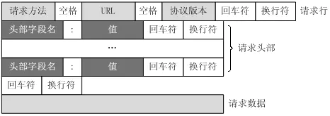

# RPC进阶之路（二）RPC协议与序列化/反序列化
这是RPC系列文章的第二篇博客，第一篇博客介绍了RPC实现需要解决的问题，以及基于RMI实现一个简单的RPC。有兴趣的小伙伴可以去看一下[《RPC概述》](./RPC概述)这篇文章。本篇文章主要讲述RPC通信协议：  
1. HTTP协议 
2. Netty协议 
3. RMI协议  

以及在对象的序列化与反序列化的相关内容


## HTTP协议

从通信模型上看，HTTP和RPC协议都是属于应用层的协议，但是两者并不互斥。或者说应用层的通信依旧可以分为好几层；在或者说RPC协议只是对底层协议进行了封装，而底层协议具体是什么并未做要求。即，RPC可以直接架在TCP协议之上，进行TCP协议的数据包读取和封装。也可以架在HTTP协议上，对HTTP协议的请求与响应报文进行封装和读取。  

由于TCP协议是在传输层的，与我们应用开发的关系不大。另外，Http协议是最常用的承载RPC的通信协议之一，我们在平常编程时经常会用到，比如对前端提供的接口会用到HttpServerRequest和HttpServerResponse这两个类。如果我们了解了Http协议，也许就能知道这两个类的根源了。我们可以通过Http协议传输json或者xml，也可以传输二进制。
### HTTP协议组成
1. URI：http是通过URI(统一资源标识符)来进行建立连接和传输数据的。而我们通常所说的URL(统一资源定位符)是一种特殊的URI,我们可以通过URL来定位到网上的特定资源。一个普通的URL,包含很多信息，如下：  
```https://github.com/chenzifeng1/```  
    - 协议：该URL的协议是```https```,这个是```http```的加密协议
    - 域名：域名就是```github.com```，发送请求时需要向DNS服务器解析```IP```
    - 端口：服务器对外服务的端口，默认是80端口，如果是80端口，可以不加端口信息。否则需要在域名后面加上端口信息```:port```
    - 虚拟目录：从域名往后的第一个```/```到最后一个```/```为止都是虚拟目录部分
    - 文件名：虚拟目录截止到最后一个```/```,文件则从这开始到第一个```?```
    - 锚：从```#```开始到最后，都是锚部分
    - 参数：从```?```开始到```#```为止之间的部分是参数部分，又称为搜索部分、查询部分
2. request:HTTP的请求包括：请求行(request line)、请求头部(header)、空行 和 请求数据 四个部分组成。


3. response

更详细内容可以查看这篇博客[http详解](https://www.jianshu.com/p/8fe93a14754c)
## Netty协议

## RMI协议