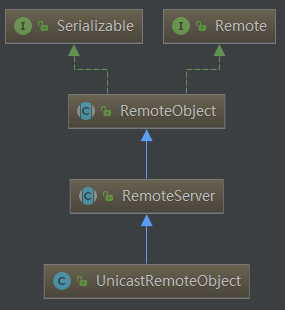
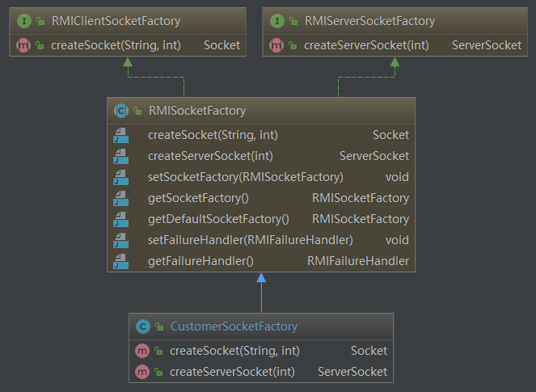

# RPC概述
远程过程调用：当我们需要调用的方法不在同一个进程中，甚至不在同一台服务器上时候，使用RPC来完成对目标方法的调用。当我们调用同一个进程中方法的时候，我们可以通过内存指针来找到方法的内存地址，使用跳转指令来跳转到对应的内存地址来执行函数。但是，当我们调用不同进程甚至不同服务器上的方法时，由于OS为每个进程都分配了一个虚拟内存，故内存寻址的方式在不同进程就无法使用，因此我们需要另一种方法来获取我们想要的方法的标识。
## RPC需要解决的问题
1. Call Id 映射：在RPC中，每个函数都需要有一个自己Id的唯一标识，这个Id在所有进程中是独一无二的。客户端在进行RPC调用时带上这个Id去服务进程请求对应的方法。实现原理大概为我们在服务端和客户端分别维护一个Call Id的映射表，映射表中的表项就是Call id与对应的函数。服务端和客户端的映射表可以不一致，但是每个Call Id与对应的函数在两个表中必须一致。
2. 序列化与反序列：这是解决我们进行RPC时，客户端如何把请求的参数传给服务端的问题。在同一过程调用时，OS会为每个进程维持一个属于自己的栈，栈帧内容就包含传递的参数或者是临时变量等，我们同一进程调用时，只需要把参数压入栈中，执行方法时从栈中弹出来即可。但是在RPC中无法通过内存来完成，甚至客户端与服务端的编程语言都不同。这时候，客户端可以把参数进行序列化，将其转换为字节流，传给服务端的时候，服务端在进行反序列化，来转成自己可以识别的格式。同样，当服务端返回结果给客户端时候也是如此。
3. 网络传输：由于RPC多是发送在网络上的，即客户端与服务端不在同一个网络节点。那么在进行服务调用时，客户端需要得到服务端的Ip地址及服务开发的端口来请求，同理，服务端在返回结果时也要知道客户端的ip与端口。在网络中传输，传输协议就必不可少，如何将数据包装，传送方式等等都会影响网络传输效果。RPC一般使用TCP协议，当然UDP也同样可以，因为我们要做到的只是让对方收到数据而已，具体怎么传输这个是网络通信来做的。
## RPC实现
  

1. RPC接口：  
我们先通过java自带的RPC实现，来看看RMI如何实现一个远程过程调用.   
首先，我们需要定义一个服务端接口，为客户端定义可以调用的方法。
```java
public interface RPCService extends Remote{
    public String getMessage(String no) throws RemoteException;
}
```
- 注：
    该接口继承了Remote接口，但是Remote接口里面什么也没定义，就想Serializable接口一样只是一个标志接口。我们在可以在这个接口中定义为客户端提供哪些方法。另外定义的方法必须显式的抛出RemoteException异常

2. RPC接口实现：  

具体的实现类来实现接口中定义的方法，必须继承UnicastRemoteObject类，该类定义了服务调用与服务提供方对象实现，并建立一对一的连接。  
  
另外，我们需要写一下构造方法，来包含UnicastRemoteObject的构造方法，可以只写一个参数为空的构造方法，只要抛出*RemoteException*即可。
```java
public class RPCServiceImpl extends UnicastRemoteObject implements RPCService {
    String ipAddress = "chenzifeng1.github.io";

    protected RPCServiceImpl() throws RemoteException {
    }

    protected RPCServiceImpl(int port) throws RemoteException {
        super(port);
    }

    protected RPCServiceImpl(int port, RMIClientSocketFactory csf, RMIServerSocketFactory ssf) throws RemoteException {
        super(port, csf, ssf);
    }

    @Override
    public String getMessage(String no) throws RemoteException {
        return ipAddress+":"+no;
    }
}
```

3. 定义服务配置类：  
定义针对服务端的配置类，RMI的通信端口是随机分配的，因此可能分配到被防火墙拦截的端口，所以我们要强制指定端口来进行通信。一般通过RMISocketFactory实现类来完成。

通过类结构可以看出，*RMISocketFactory*继承了两个接口*RMIClientSocketFactory*、*RMIServerSocketFactory*,这两个接口中分别定义了*createSocket()*、*createServerSocket*两个方法，其实就是定义客户端和服务端创建套接字的方法，在*RMISocketFactory*中并未实现这两个方法，只是将其作为抽象方法，交给子类实现。*RMISocketFactory*只是实现了SocketFactory的get/set方法，以及默认的SocketFactory的get/set方法，以及失败处理器。失败处理器*Failure Handler*会在RMI运行时创建Server Socket失败时被调用。
```java
public class CustomerSocketFactory extends RMISocketFactory{
    private static Logger logger = LoggerFactory.getLogger(CustomerSocketFactory.class);

    @Override
    public Socket createSocket(String host, int port) throws IOException {
        return new Socket(host,port);
    }

    @Override
    public ServerSocket createServerSocket(int port) throws IOException {
        //指定端口
        if (port ==0){
            port = 8855;
        }
        logger.info("指定端口："+port);
        return new ServerSocket(port);
    }
}
```
所以我们要定义一个*RMISocketFactory*的子类来实现两个没有实现的抽象方法。其中*createServerSocket*中要强制指定通信端口，如果port不传值的话，参数是int型，默认为0。

4. 创建服务启动类：
```java

public class RMIServerMain {
    private final static Logger log = LoggerFactory.getLogger(RMIServerMain.class);
    //注册服务
    public static void main(String[] args) {
        try {
            //指定端口，防止防火墙拦截
            LocateRegistry.createRegistry(8866);
            //创建服务
            RMISocketFactory.setSocketFactory(new CustomerSocketFactory());

            RPCService rpcService = new RPCServiceImpl();
            Naming.bind("rmi://localhost:8866/myService",rpcService);

            log.info("rmi 服务启动");
        } catch (RemoteException e) {
            e.printStackTrace();
        } catch (IOException e) {
            e.printStackTrace();
        } catch (AlreadyBoundException e) {
            e.printStackTrace();
        }
    }
}
```


5. 创建客户端
```java
public class RPCClient {

    public static void main(String[] args) throws RemoteException, NotBoundException, MalformedURLException {
        //设置安全管理器
       System.setSecurityManager(new SecurityManager());

       RPCService rpcService = (RPCService) Naming.lookup("rmi://localhost:8866/myService");

        System.out.println(rpcService.getMessage("1235"));
    }
}
```