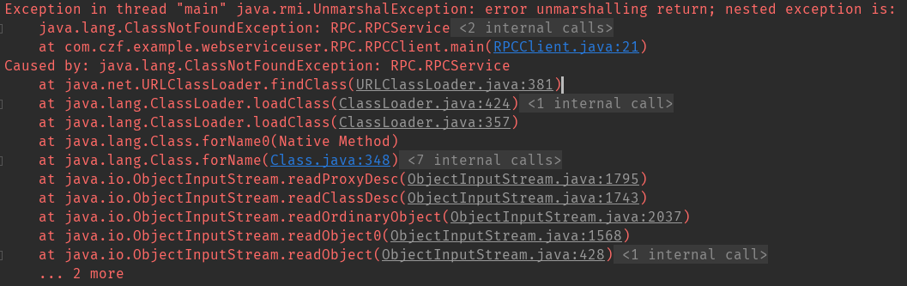
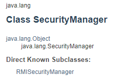

# RPC概述
远程过程调用：当我们需要调用的方法不在同一个进程中，甚至不在同一台服务器上时候，使用RPC来完成对目标方法的调用。当我们调用同一个进程中方法的时候，我们可以通过内存指针来找到方法的内存地址，使用跳转指令来跳转到对应的内存地址来执行函数。但是，当我们调用不同进程甚至不同服务器上的方法时，由于OS为每个进程都分配了一个虚拟内存，故内存寻址的方式在不同进程就无法使用，因此我们需要另一种方法来获取我们想要的方法的标识。
## RPC需要解决的问题
1. Call Id 映射：在RPC中，每个函数都需要有一个自己Id的唯一标识，这个Id在所有进程中是独一无二的。客户端在进行RPC调用时带上这个Id去服务进程请求对应的方法。实现原理大概为我们在服务端和客户端分别维护一个Call Id的映射表，映射表中的表项就是Call id与对应的函数。服务端和客户端的映射表可以不一致，但是每个Call Id与对应的函数在两个表中必须一致。
2. 序列化与反序列：这是解决我们进行RPC时，客户端如何把请求的参数传给服务端的问题。在同一过程调用时，OS会为每个进程维持一个属于自己的栈，栈帧内容就包含传递的参数或者是临时变量等，我们同一进程调用时，只需要把参数压入栈中，执行方法时从栈中弹出来即可。但是在RPC中无法通过内存来完成，甚至客户端与服务端的编程语言都不同。这时候，客户端可以把参数进行序列化，将其转换为字节流，传给服务端的时候，服务端在进行反序列化，来转成自己可以识别的格式。同样，当服务端返回结果给客户端时候也是如此。
3. 网络传输：由于RPC多是发送在网络上的，即客户端与服务端不在同一个网络节点。那么在进行服务调用时，客户端需要得到服务端的Ip地址及服务开发的端口来请求，同理，服务端在返回结果时也要知道客户端的ip与端口。在网络中传输，传输协议就必不可少，如何将数据包装，传送方式等等都会影响网络传输效果。RPC一般使用TCP协议，当然UDP也同样可以，因为我们要做到的只是让对方收到数据而已，具体怎么传输这个是网络通信来做的。
## RPC实现

RPC实现分为同步调用和异步调用：
- 同步调用：客户端调用服务端方法，发送调用请求后等待服务端返回，等待返回期间客户端不进行其他计算，返回结束之后客户端继续执行其他计算。同步调用实现有WebService和RMI.WebService是基于Web容器的，底层通信协议是http，因此可以跨语言使用，比如说服务端是C提供的，客户端java调用的，但是当跨语言调用时可能会有坑，不过可以传JSON来统一。RMI时java的RPC实现,允许返回Java对象和基本数据类型。
- 异步调用：客户端调用服务端方法时不需要等待服务端返回结果，可以执行别的操作。等服务端传完数据时可以通知客户端来读取数据。异步调用的实现有JMS(java message service)是JavaRPC异步调用的实现，与之相关的JMS开源中间件有Apache社区的ActiveMQ、Kafka消息中间件，另外有阿里的RocketMQ。
1. RPC接口：  
我们先通过java自带的RPC实现，来看看RMI如何实现一个远程过程调用.   
首先，我们需要定义一个服务端接口，为客户端定义可以调用的方法。
```java
package RPC;

import java.rmi.Remote;
import java.rmi.RemoteException;

public interface RPCService extends Remote{
    public String getMessage(String no) throws RemoteException;
}
```
- 注：
    该接口继承了Remote接口，但是Remote接口里面什么也没定义，就想Serializable接口一样只是一个标志接口。我们在可以在这个接口中定义为客户端提供哪些方法。另外定义的方法必须显式的抛出RemoteException异常

2. RPC接口实现：  

具体的实现类来实现接口中定义的方法，必须继承UnicastRemoteObject类，该类定义了服务调用与服务提供方对象实现，并建立一对一的连接。  
  
另外，我们需要写一下构造方法，来包含UnicastRemoteObject的构造方法，可以只写一个参数为空的构造方法，只要抛出*RemoteException*即可。
```java
public class RPCServiceImpl extends UnicastRemoteObject implements RPCService {
    String ipAddress = "chenzifeng1.github.io";

    protected RPCServiceImpl() throws RemoteException {
    }

    protected RPCServiceImpl(int port) throws RemoteException {
        super(port);
    }

    protected RPCServiceImpl(int port, RMIClientSocketFactory csf, RMIServerSocketFactory ssf) throws RemoteException {
        super(port, csf, ssf);
    }

    @Override
    public String getMessage(String no) throws RemoteException {
        return ipAddress+":"+no;
    }
}
```

3. 定义服务配置类：  
定义针对服务端的配置类，RMI的通信端口是随机分配的，因此可能分配到被防火墙拦截的端口，所以我们要强制指定端口来进行通信。一般通过RMISocketFactory实现类来完成。

通过类结构可以看出，*RMISocketFactory*继承了两个接口*RMIClientSocketFactory*、*RMIServerSocketFactory*,这两个接口中分别定义了*createSocket()*、*createServerSocket*两个方法，其实就是定义客户端和服务端创建套接字的方法，在*RMISocketFactory*中并未实现这两个方法，只是将其作为抽象方法，交给子类实现。*RMISocketFactory*只是实现了SocketFactory的get/set方法，以及默认的SocketFactory的get/set方法，以及失败处理器。失败处理器*Failure Handler*会在RMI运行时创建Server Socket失败时被调用。
```java
public class CustomerSocketFactory extends RMISocketFactory{
    private static Logger logger = LoggerFactory.getLogger(CustomerSocketFactory.class);

    @Override
    public Socket createSocket(String host, int port) throws IOException {
        return new Socket(host,port);
    }

    @Override
    public ServerSocket createServerSocket(int port) throws IOException {
        //指定端口
        if (port ==0){
            port = 8855;
        }
        logger.info("指定端口："+port);
        return new ServerSocket(port);
    }
}
```
所以我们要定义一个*RMISocketFactory*的子类来实现两个没有实现的抽象方法。其中*createServerSocket*中要强制指定通信端口，如果port不传值的话，参数是int型，默认为0。

4. 创建服务启动类：  
服务启动的话，我们要做几点工作：1.开放端口，防止被防火墙拦截。2.创建Socket准备进行连接。3.将我们实现的服务绑定到对应的url上。  
- 开放端口，我们使用的是```LocateRegistry.createRegistry(int port);```，LocateRegistry用来获取特定host上指定的远程对象的注册表项，或者是在特定的端口创建一个接受调用的远程对象的注册表项。因为我们写服务端的时候是对外提供方法，因此我们需要创建一个Registry，并指定端口信息。可以看到createRegistry方法只是返回了一个RegistryImpl的实例，这个类实现了Registry接口。
```java
public static Registry createRegistry(int port) throws RemoteException {
    return new RegistryImpl(port);
}
```
- 创建服务，我们设置Socket的工厂方法，将我们写好的CustomerSocketFactory的实例作为参数传入，
```java
public class RMIServerMain {
    private final static Logger log = LoggerFactory.getLogger(RMIServerMain.class);
    //注册服务
    public static void main(String[] args) {
        try {
            //指定端口，防止防火墙拦截
            LocateRegistry.createRegistry(8866);
            //创建服务
            RMISocketFactory.setSocketFactory(new CustomerSocketFactory());

            RPCService rpcService = new RPCServiceImpl();
            Naming.bind("rmi://localhost:8866/RPCService",rpcService);

            log.info("rmi 服务启动");
        } catch (RemoteException e) {
            e.printStackTrace();
        } catch (IOException e) {
            e.printStackTrace();
        } catch (AlreadyBoundException e) {
            e.printStackTrace();
        }
    }
}
```


5. 创建客户端,客户端要做的事比较简单，只要找到服务端发布的服务就可以了，
```java
public class RPCClient {

    public static void main(String[] args) throws RemoteException, NotBoundException, MalformedURLException {
        //设置安全管理器
       System.setSecurityManager(new SecurityManager());

       RPCService rpcService = (RPCService) Naming.lookup("rmi://localhost:8866/RPCService");

        System.out.println(rpcService.getMessage("1235"));
    }
}
```
但是，为了方便的调用服务端的方法，我们可以用对应的服务器接口来承接服务实例，当然这个也是必须的。之所以必须，是因为*Naming.lookup(serviceHost)* 这个方法会在本地寻找有无路径一致的服务接口。  
```java
    public static Remote lookup(String name)
        throws NotBoundException,
            java.net.MalformedURLException,
            RemoteException
    {
        ParsedNamingURL parsed = parseURL(name);
        Registry registry = getRegistry(parsed);

        if (parsed.name == null)
            return registry;
        return registry.lookup(parsed.name);
    }
```
在这个lookup方法中最重要的是返回时调用的  *registry.lookup(parsed.name)* 这个方法，这个方法是个接口方法，我们真正调用的是*RegistryImpl_Stub*重写的lookup方法。其他两个方法是将传进来的服务地址分解，找到对应的IP,端口和服务名称。
```java
public final class RegistryImpl_Stub extends RemoteStub implements Registry, Remote {
    public Remote lookup(String var1) throws AccessException, NotBoundException, RemoteException {
        try {
            RemoteCall var2 = this.ref.newCall(this, operations, 2, 4905912898345647071L);

            try {
                ObjectOutput var3 = var2.getOutputStream();
                var3.writeObject(var1);
            } catch (IOException var17) {
                throw new MarshalException("error marshalling arguments", var17);
            }

            this.ref.invoke(var2);

            Remote var22;
            try {
                ObjectInput var4 = var2.getInputStream();
                var22 = (Remote)var4.readObject();
            } catch (IOException var14) {
                throw new UnmarshalException("error unmarshalling return", var14);
            } catch (ClassNotFoundException var15) {
                throw new UnmarshalException("error unmarshalling return", var15);
            } finally {
                this.ref.done(var2);
            }

            return var22;
        } catch (RuntimeException var18) {
            throw var18;
        } catch (RemoteException var19) {
            throw var19;
        } catch (NotBoundException var20) {
            throw var20;
        } catch (Exception var21) {
            throw new UnexpectedException("undeclared checked exception", var21);
        }
    }
}    
```
lookup方法主要分为三个部分，首先建立一个远程调用。
```java
RemoteCall var2 = this.ref.newCall(this, operations, 2, 4905912898345647071L);
```
之后向服务端发送数据
```java
ObjectOutput var3 = var2.getOutputStream();
var3.writeObject(var1);
```
最后从服务端获取数据,并返回
```java
ObjectInput var4 = var2.getInputStream();
var22 = (Remote)var4.readObject();
return var22;
```
我在测试时，出现的问题如下：
1. RMI在调用时，客户端需要有对应的服务接口，且服务接口的路径名需要与服务端一致，不然会抛出异常。这个问题就是在lookup中从服务端读取数据代码中抛出的。  


```
Exception in thread "main" java.rmi.UnmarshalException: error unmarshalling return; nested exception is: 
java.lang.ClassNotFoundException: RPC.RPCService
```
我们可以从异常信息中得知是找不到*RPC.RPCService*这个类，从[RPC接口](#RPC实现)看出服务端的RPCService的路径就是*RPC.RPCService*，而服务端也必须有对应的接口才行。另外经过测试，服务路径**rmi://localhost:8866/myService**中端口后面的路径是自己定义的，与接口名不一样也可，在服务启动时，通过*Naming.bind(host,)*已经将路径和对应的接口绑定了。但是建议路径的service与对应Service一致，方便服务端查找服务。


## SecurityManager
  
这个并不属于RPC的模块，但是在RPC调用时却必不可少，在这里简单介绍一下。  
这个[SecurityManager](https://docs.oracle.com/javase/7/docs/api/java/lang/SecurityManager.html)允许应用程序实现自己的安全策略。在程序进行不安全或敏感操作之前，*SecurityManager*允许应用定义那些操作是安全的。*SecurityManager*包含很多以*check*开头的方法。这些checkXXX方法会被java库中的各种方法在执行敏感操作之前调用，来检查要执行的操作是否安全。
```java
     SecurityManager security = System.getSecurityManager();
     if (security != null) {
         security.checkXXX(argument,  . . . );
     }
```

下一篇博客是关于[RPC协议与序列化/反序列化](./RPC协议与序列化/反序列化.md)