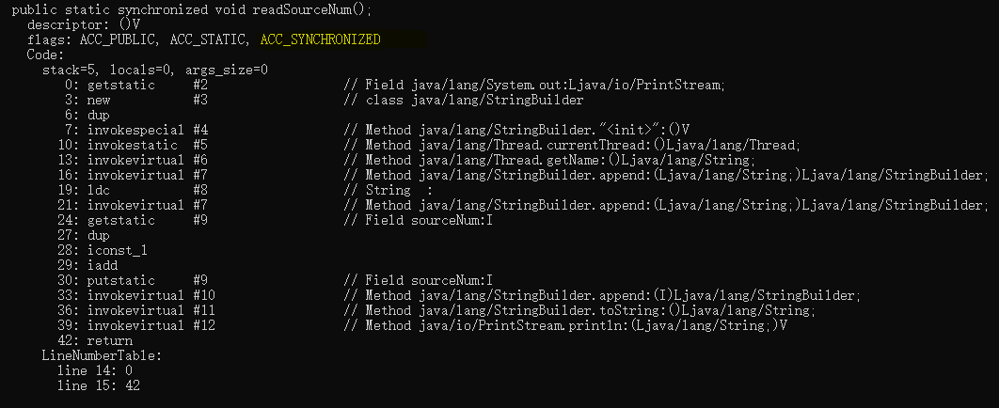
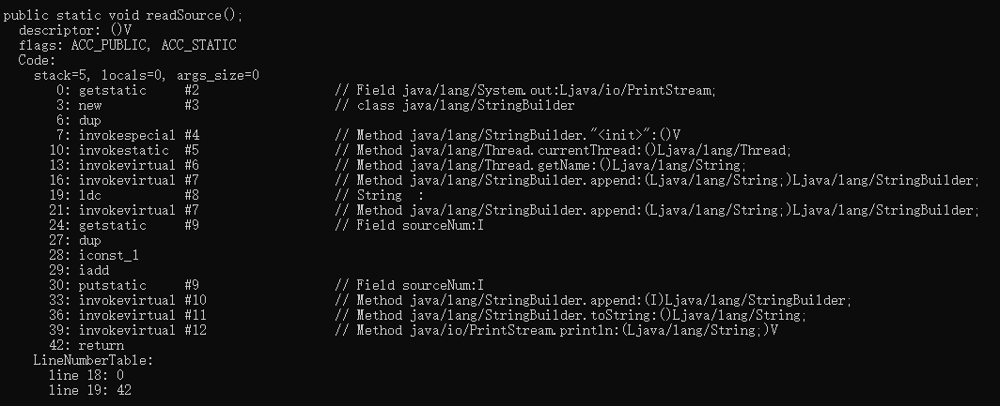
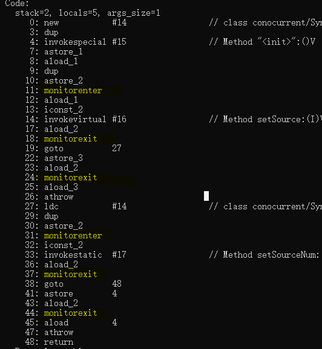

# 多线程编程
在介绍三种线程同步实现之前，先简单说一下如何实现多线程。主要介绍三种方式：  
1. 实现Runnable接口：Runnable接口只有一个run方法，而我们所要做的就是重写Run方法，将我们想要交给线程执行的过程在run方法实现。  
    ```java
    public class Thread1 implements Runnable {
            private static SimpleDateFormat simpleDateFormat = new SimpleDateFormat("yyyy-MM-DD hh:mm:ss");
            @Override
            public void run() {
                System.out.println(simpleDateFormat.format(new Date()));
            }
        }
        //测试
    public class Test {
        public static void main(String[] args) throws InterruptedException {
            for(int i =0; i<7 ;i++){
                new Thread(new Thread1()).start();
            }
        }
    } 
    ```
    注：实现Runnable只是重写了run方法，但是实际上启动线程的是start方法，如果我们只调用我们重写的run方法，其实际效果与调用普通对象的成员方法效果是一样的。所以要把我们想运行的线程交给Thread，Thread调用start之后，我们定义的线程会根据CPU资源分配情况进行调度，相关内容可以查看[Thread源码实现](./Thread源码解析.md)。

2. 继承Thread类：Thread类本身就实现了Runnable接口，并在此基础上增加了很多方法。与第一种方法相比，由于父类Thread已经实现了start方法，因此我们可以直接调用父类的start方法来启动线程。
    ```java
    public class Thread2 extends Thread {
        @Override
        public void run() {
            System.out.println(new Date());
            try {
                sleep(1000);
            } catch (InterruptedException e) {
                e.printStackTrace();
            }
        }
    }
    //测试
    public class Test {
        public static void main(String[] args) throws InterruptedException {
            for(int i =0; i<7 ;i++){
                new Thread(new Thread1()).start();
            }
        }
    }
    ```
3. 使用ExecutorService、Callable、Future实现有返回结果的多线程。
这种方法是通过线程池来完成多线程编程，并且实现了Callable接口会在线程执行完之后返回结果。线程池的优点有很多，具体可以查看[线程池]()  

    ```java
    public class MyCallable implements Callable {
        private String id ;
        @Override
        public Object call() throws Exception {
            Date date = new Date();
            id = date.toString()+Thread.currentThread().getName();
            return id;
        }
    }
    //测试
    public class Test {
        private static final int CORE_POOL_SIZE = 5;

        public static void main(String[] args) throws InterruptedException {
            ExecutorService pool_1 = Executors.newFixedThreadPool(5);
            List<Future> result = new ArrayList<>();

            for (int i = 0; i < CORE_POOL_SIZE; i++) {
                Callable callable = new MyCallable();
                Future future = pool_1.submit(callable);
                result.add(future);
            }
            //关闭线程池
            pool_1.shutdown();
            for (Future f : result) {
                try {
                    System.out.println(f.get().toString());
                } catch (ExecutionException e) {
                    e.printStackTrace();
                }
            }
        }
    }
    ```
    与前两种方法不同，这种方法实现了Callable接口，实现了其中的call方法，call方法有返回值，并可以抛出异常。另外，在调用时也是与之前的方法不一样，通过创建好的线程池来执行，我们将实现Callable的类实例作为线程池的task提交给线程池，之后有线程池为其分配线程来执行。执行之后返回的是一个Future对象，我们可以通过future.get()来获取其中的返回值。

## synchronized实现线程同步
synchronized是java实现多线程并发编程的一个重要关键字，是Java同步机制的一种实现，即互斥锁机制，它所获得的锁叫做互斥锁。互斥锁是每个对象的锁一次只能分配给一个线程，同一时间只能由一个线程占用。synchronized用于保证同一时刻只能由一个线程进入到临界区，同时保证共享变量的可见性、原子性和有序性。当一个线程试图访问同步代码方法(块)时，它首先必须得到锁，退出或抛出异常时必须释放锁。

用法：1.静态方法，2.普通方法，3.代码块这三个层面上，可以看出synchronized关键字作用在一段代码上，目的是为了让同一时间只有一个线程可以执行这段代码，那么这段代码所进行的属性操作也就是线程安全的。synchronized的作用主要是三个方面：  
1. 使线程互斥的访问同步代码，这是通过为同步代码段加锁来实现的 
2. 使共享资源在线程之间可见
3. 防止指令重排序，因为jvm会通过对指令执行顺序重排序来提高代码执行效率，但是这一优化在多线程并发的场景下可能会导致一些意外的结果。

我们分别介绍这三个层面上synchronized的底层实现。
1. 静态方法：  
    ```java
    public class  SynchronizedLearn {
        private static  int sourceNum = 0;

        public static synchronized void readSourceNum(){
            System.out.println(Thread.currentThread().getName()+" : "+sourceNum++);
        }

        public static void readSource(){
            System.out.println(Thread.currentThread().getName()+" : "+sourceNum++);
        }
    }    
    ```
    我们对这个类进行编译使用命令```javac SynchronizedLearn.java```,得到.class字节码文件，然后对该字节码文件进行反汇编```javap -c -s -v -l SynchronizedLearn```。
    由于两个方法除了readSourceNum被*synchronized*修饰之外，其他的地方一模一样，这样可以通过反汇编之后比较两者，来找到*synchronized*修饰静态方法时是如何实现的。  
    - public static synchronized void readSourceNum()  
    

    - public static void readSource()
    

    综上，可以看出synchronized通过对静态方法加**ACC_SYNCHRONIZED**来表明该静态方法是同步方法。

2. 普通方法：
    ```java
    public class  SynchronizedLearn {
        private static  int sourceNum = 0;

        public  synchronized void readSourceNum(){
            sourceNum = 1*2+sourceNum;
        }

        public  void readSource(){
            sourceNum = 1*2+sourceNum;
        }
    }
    ```
    结果与上面的静态方法一样，都是javac为其生成了**ACC_SYNCHRONIZED**关键字，在JVM进行方法调用时，发现调用的方法被ACC_SYNCHRONIZED修饰，则会先尝试获得锁。与静态方法不同，在flags中没有**ACC_STATIC**关键字而已。

3. 代码块： 
    ```java
    public class  SynchronizedLearn {
        private static  int sourceNum = 0;
        private int source = 0;
        public static void main(String[] args){
            SynchronizedLearn synchronizedLearn = new SynchronizedLearn();
            synchronized (synchronizedLearn){
                synchronizedLearn.setSource(2);
            }
            synchronized (SynchronizedLearn.class){
                SynchronizedLearn.setSourceNum(2);
            }
        }
    }    
    ```
    我们将其编译之后进行反汇编查看对代码块加互斥锁的区别，另外查看在对象层次和在类层次上两者的不同。  
      

    与在方法上加*synchronized*不同的是，javac为代码块加了两个字段**monitorenter**和**monitorexit**。虽然没看出锁加载对象层面与加在类层面有什么不同，但是有一点需要记住，即被加锁的对象和类互不影响。一个线程在持有对象锁时，另一个线程依旧可以持有类锁。
