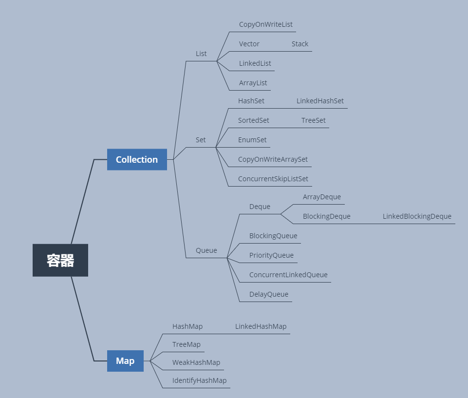

# 容器(一) List

容器分类如下图：


这一篇主要介绍容器中的List这一部分。List是线性结构，元素要求统一，主要的实现方式有`链表`和`数组`两种类型。
注意一点，List是线程不安全的，如果想使用线程安全的线性数据结构的话建议使用`Queue`.
## 数组List
以数组为底层数据结构实现的List有`ArrayList`这个是我们比较常用的，其中比较重要的方法就是如何进行扩容与缩容。
由于是数组实现的，所以`ArrayList`具有数组的特点： 随机读/写效率高，尾部插入、删除效率也较高。但是中间件的插入与删除都会引起
元素的移动，其移动规模与插入的位置相关。
## 源码实现

### 类的属性
-    private static final int DEFAULT_CAPACITY = 10：   默认容量，在new对象的时候不指定初始容量时，默认的容量为10
-    private static final Object[] EMPTY_ELEMENTDATA = new Object[0];  空的`ArrayList`中，数组指向元素个数0该对象。因为元素为0时，数组并无实际意义，没必要对每个元素个数为0 的
     数组都开辟新的内存空间去存放一个新的数组变量。
-    private static final Object[] DEFAULTCAPACITY_EMPTY_ELEMENTDATA = new Object[0];  默认空的数组变量，这个与上一个使用的地方有所区别。
-    transient Object[] elementData;  数组元素实际存放的位置，`transient`关键字表明该变量不会被序列化。
-    private int size;  数组内元素的个数
-    private static final int MAX_ARRAY_SIZE = 2147483639;  数组元素最大的长度。

### 类的方法
```java

public class ArrayList<E> extends AbstractList<E> implements List<E>, RandomAccess, Cloneable, Serializable {
    /**
     * 
     */
    public void trimToSize() {
        ++this.modCount;
        if (this.size < this.elementData.length) {
            this.elementData = this.size == 0 ? EMPTY_ELEMENTDATA : Arrays.copyOf(this.elementData, this.size);
        }

    }

    /**
     * 
     * @param minCapacity
     */
    public void ensureCapacity(int minCapacity) {
        if (minCapacity > this.elementData.length && (this.elementData != DEFAULTCAPACITY_EMPTY_ELEMENTDATA || minCapacity > 10)) {
            ++this.modCount;
            this.grow(minCapacity);
        }

    }

    /**
     * 
     * @param minCapacity
     * @return
     */
    private Object[] grow(int minCapacity) {
        return this.elementData = Arrays.copyOf(this.elementData, this.newCapacity(minCapacity));
    }

    /**
     * 
     * @return
     */
    private Object[] grow() {
        return this.grow(this.size + 1);
    }

    /**
     * 
     * @param minCapacity
     * @return
     */
    private int newCapacity(int minCapacity) {
        int oldCapacity = this.elementData.length;
        int newCapacity = oldCapacity + (oldCapacity >> 1);
        if (newCapacity - minCapacity <= 0) {
            if (this.elementData == DEFAULTCAPACITY_EMPTY_ELEMENTDATA) {
                return Math.max(10, minCapacity);
            } else if (minCapacity < 0) {
                throw new OutOfMemoryError();
            } else {
                return minCapacity;
            }
        } else {
            return newCapacity - 2147483639 <= 0 ? newCapacity : hugeCapacity(minCapacity);
        }
    }

    /**
     * 
     * @param minCapacity
     * @return
     */
    private static int hugeCapacity(int minCapacity) {
        if (minCapacity < 0) {
            throw new OutOfMemoryError();
        } else {
            return minCapacity > 2147483639 ? 2147483647 : 2147483639;
        }
    }
    
}
```